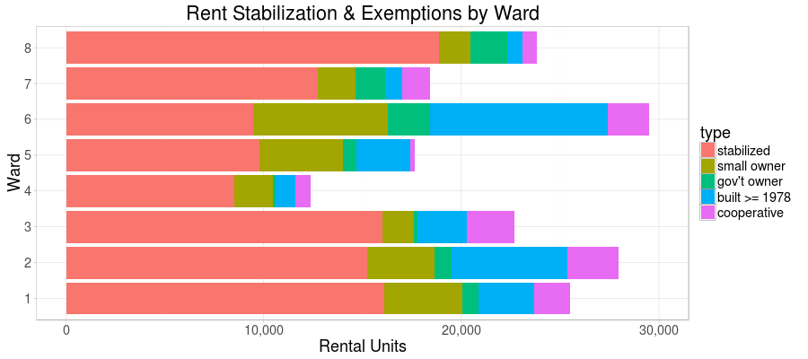
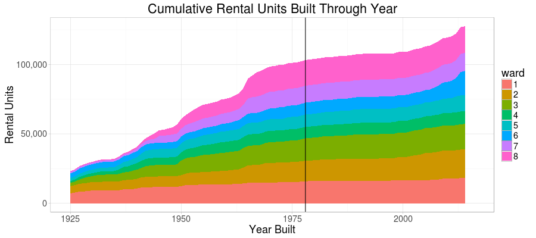
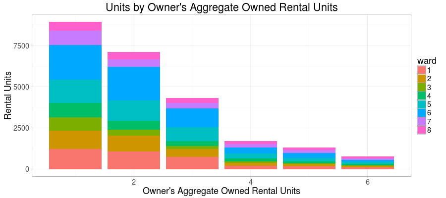

# Rent Stabilization Policy Analysis

The Rent Stabilization Program in the District of Columbia ([DC Code § 42–3502.05](https://beta.code.dccouncil.us/dc/council/code/sections/42-3502.05.html)) restricts the yearly rent increases that landlords can impose on tenants.

Rent stabilization covers all rental units _except_ those for which an exemption applies. The primary exemptions are for government owned buildings, for buildings whose building permit was issued in 1976 or later, and for owners who are not corporations and own four or fewer rental units in the District.

This analysis evaluates how a change in rent stabilization policy would affect rental properties in the District.

For more background, see see this project's [README](README.md).

## Methodology

Our analysis is based on the [Computer Assisted Mass Appraisal (CAMA) database](http://opendata.dc.gov/datasets?q=cama&sort_by=relevance) which is a database of properties, created primarily by the District government for tax assessment purposes.

The CAMA dataset, in combination with [real property use codes](http://opendata.dc.gov/datasets/9d8e09cb7403445ca8b4354cac6ae776_54) ([PDF](http://otr.cfo.dc.gov/sites/default/files/dc/sites/otr/publication/attachments/Use%20codes.pdf)) assigned by the District, tells us:

* Whether a property is residential.

* The owner of a property (including if the government).

* The year the property was built (CAMA's `AYB` field).

* The number of residential units within a building (more or less).

### Unit of Analysis

Our unit of analysis is a rental unit, i.e. an apartment or other single-family unit of housing which is rented (not owner-occupied).

#### Determining Residential Properties

From the CAMA dataset, we pulled out residential properties as identified by the use codes listed in [use-codes.csv](use-codes.csv).

#### Determining Residential Housing Units

CAMA's unit of analysis is an owned property, which can be a house, a large apartment building, or a single condominium unit. We broke out the CAMA data into residential housing units (i.e. apartments, single-family homes and condos, etc.).

However, the CAMA data does not precisely indicate how many housing units are contained within each record, even though the CAMA datasets have a number-of-units field. Where this field was empty, which includes most small residential properties, we used the use code, which indicates if the property has 1, 2-4, 5, or an unknown number of housing units. Where the use code indicated 2-4 units, we randomly gave the property 2, 3, or 4 housing units using a non-uniform distribution: 60% to 2 units, 30% to 3, and 10% to 4. (This distribution was informed by a post-hoc analysis.) Where neither CAMA nor the use code indicated a number, we omitted the property from our analysis (but very few properties were excluded).

#### Determining Rental Units

Not all residential housing units are rented. Some are occupied by their owner, and these owner-occupied units are not relevant to a rent stabilization analysis.

The CAMA dataset does not indicate --- and we had no readily available way to determine --- if a housing unit is owner-occupied or rented.

However, we made the assumption that each "natural person" owner (see below) lives in exactly one housing unit that they own. For example, our analysis omits single-family houses whose owner is not listed as owning any other housing units. If an owner owns two or more units, one unit is discounted.

### Building Permit Year

We did not readily have access to the year each property's building permit was issued.

Instead we used the "actual year built" field in CAMA, and added 2 years, on the assumption of a typical two year delay between the issuance of a building permit and the construction of a building.

The "AYB" field in CAMA is a little messy. When the field did not contain a legitimate year, we treated the year as 1900. This did not affect many buildings.

### Government-owned, Corporate-owned, and Cooperative Properties

Residential housing units were marked as **government-owned** if CAMA lists the owner as `UNITED STATES OF AMERICA`,  `DISTRICT OF COLUMBIA`, or `DISTRICT OF COLUMBIA HOUSING AUTHORITY`.

Residential housing units were marked as being **not owned by a "natural person"** (per the law) if the owner name in CAMA ends with `LLC`, `LP`, `INC`, `TRUSTEE`, `ASSOCIATES`, `PARTNERSHIP`, `CORPORATION`, `TRUSTEES`, `ASSOCIATION`, `TRUST`, `COMPANY`, `PRTNSHP`, `LTD`, `VENTURE`, `CORP`, `L.P.`, `LTP`, `UNIVERSITY`, `PROPERTY`, `PTSP`, `CORPORTATION`, `PROPERTIES`, `LLP`, `HOUSING`, `APARTMENTS`, `PART`, `FOUNDATION`, or `CHURCH`.

Residential housing units were marked as being a part of a **cooperative** if the property use code was 26, 27, 126, or 127. For the purposes of this analysis, all such units were considered exempt from rent stabilization, although the law is more complex.

### Owner's Aggregate Owned Units

Properties owned by a "natural person" may be exempt from rent stabilization if the owner owns four or fewer rental units in aggregate.

To determine how many rental units a unit's owner owns, we first counted the total number of residential units an owner owns. We assumed that each building has a single owner and, to aggregate across properties, we assumed that two properties are owned by the same person just when their owner in the CAMA dataset is an identical text string. Per the assumption that "natural person" owners occupy one of their own units, we subtracted one from the ownership count to determine the number of _rental_ units owned.

This analysis is very sensitive to the number of units determined to be in a property (see above). We do not know if CAMA owner text matching is over-estimating (because of name clashes) or under-estimating (because of variations in name spelling) the aggregate number of units owned by owners.

### Ward and ANC

We determined the ward and ANC that each residential housing unit is in using the District's [ward](http://opendata.dc.gov/datasets/0ef47379cbae44e88267c01eaec2ff6e_31) and [SMD](http://opendata.dc.gov/datasets/890415458c4c40c3ada2a3c48e3d9e59_21) geospatial datasets, using the latitude/longitude coordinate of each CAMA property.

## Results

### Overview

The data indicates that there are 304,244 residential housing units in the District of Columbia.

Of those, 171,444 were considered by our analysis to be rental housing units.

60% of rental housing units in the District are subject to rent stabilization. The remaining 40% are exempt (if the owner requests and receives an exemption) for the following reasons:

| Exemption Type  | # of rental units | % of rental units |
| --------------- | ----------------- | ----------------- |
| (Not Exempt)            | 102,223 | 60% |
| Built >= 1978         | 25,352 | 15%  |
| Owner Owns <= 4 Units | 23,639 | 14%  |
| Cooperative           | 12,079 | 7%   |
| Government Owner      | 8,147  | 5%   |

(A very small number of units are exempt for multiple reasons. Units that fall under both of the first two exemptions in this table are counted only in the second exemption, so that the rows add up to 100%.)

Breaking this down by ward, we can see that Ward 6 in particular stands out as having many rental units but few subject to rent stabilization:

### Year Built

We considered how a change in the building permit year exemption would affect how many rental units were subject to rent stabilization. Moving the year foward in time, to 1986 or 1996, for example, would cause more units to fall under rent stabilization.

There appears to have been little growth in housing stock between 1970 and 2000, and so a change in the cut-off year in the law would have a relatively small impact on stabilized units.

The chart below shows the cumulative number of rental units by their year built, excluding units exempt for reasons other than their permit year. The height of the shaded area represents the number of rental units that would be subject to rent stabilization were the law to apply to units built on that year or before. The year 1978 --- two years following the 1976 cut-off in current law (see above) --- is marked by a vertical black line.

Sweeping the line to the right, few new rental units would be brought under the law until about the year 2000.

Changing the law from 1976 to 1996 --- a twenty-year shift --- would add 5,732 new units to rent stabilization, or 3% of rental units.

### Aggregate Units Owned

We considered how a change in the threshold for aggregate owned units would affect how many rental units were subject to rent stabilization. Reducing the threshold, say from 4 units to 3, would subject more owners --- and their units --- to rent stabilization.

Our analysis here is senstive to our assumption about the number of units within small residential housing structures, for which we mostly made a guess on the number of units informed by the structure's property use code, as well as on the quality of the CAMA ownership field. It is not clear how accurate the results in this section are.

The chart below shows the count of units by how many rental units the owner owns in aggregate. The units from 1 through 4 are potentially exempt from rent stabilization. The chart excludes units exempt for other reasons, e.g. units in a building built in or after 1978.

Few units are owned by an owner who owns 4 rental units in aggregate, according to our assumptions. Changing the threshold in the law from 4 units to 3 would cause rent stabilization to apply to approximately 1,710 new units, or 1% of all rental units.

### Both Policy Changes

A change in the law shifting the building permit year forward twenty years _and_ reducing the aggregate units cut-off from 4 to 3 would cause rent stabilization to apply to 7,468 more units, or 4% of all rental units, compared to current law. (Almost no units are exempt for multiple reasons.)

### Analysis by Ward

The chart below shows how many units would be subject to rent stabilization after a change in rent stabilization law --- either a twenty-year shift in the building permit year or a reduction in the aggregate owned units from 4 to 3.

The effects of the two hypothetical changes in the law differ substantially from ward to ward. Ward 6, which has a large number of rental units but relatively few subject to rent stabilization, has the most to gain from a change in the law.

